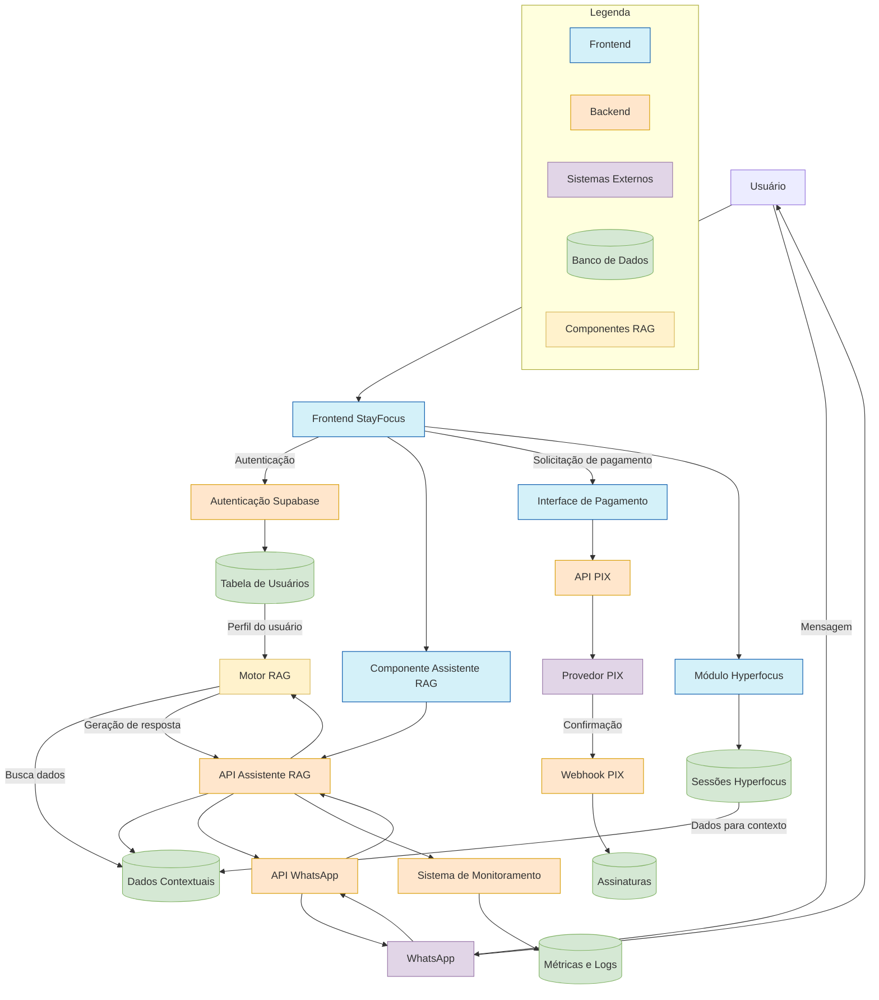

# Diagrama de Fluxo: Integração RAG com StayFocus, WhatsApp e PIX

O diagrama acima ilustra o fluxo completo de integração do assistente RAG com o sistema StayFocus, incluindo WhatsApp e o sistema de pagamentos PIX. Este diagrama pode ser visualizado em qualquer renderizador Mermaid, como o GitHub ou editores Markdown que suportam Mermaid.

## Componentes Principais

### Frontend
- **Frontend StayFocus**: Interface principal da aplicação
- **Componente Assistente RAG**: Interface do usuário para interação com o assistente
- **Interface de Pagamento**: Componente para processar pagamentos
- **Módulo Hyperfocus**: Gerencia sessões de foco intenso dos usuários

### Backend
- **Autenticação Supabase**: Gerencia identidades e sessões de usuários
- **API Assistente RAG**: Processa solicitações ao assistente
- **API WhatsApp**: Gerencia comunicação com WhatsApp
- **API PIX**: Processa solicitações de pagamento
- **Webhook PIX**: Recebe confirmações de pagamento
- **Sistema de Monitoramento**: Monitora desempenho e erros

### Banco de Dados (Supabase)
- **Tabela de Usuários**: Armazena perfis e preferências
- **Dados Contextuais**: Armazena informações para contextualização do RAG
- **Assinaturas**: Registra pagamentos e status de assinatura
- **Sessões Hyperfocus**: Armazena dados de sessões de concentração
- **Métricas e Logs**: Armazena dados de monitoramento

### Sistemas Externos
- **WhatsApp**: Plataforma de mensagens
- **Provedor PIX**: Serviço de pagamentos

### Componentes RAG
- **Motor RAG**: Núcleo da funcionalidade de geração aumentada por recuperação

## Como Interpretar o Fluxo

1. O usuário interage com o sistema via frontend ou WhatsApp
2. Autenticação é gerenciada pelo Supabase
3. As solicitações ao assistente são processadas pelo motor RAG
4. O motor RAG busca dados contextuais para personalizar respostas
5. Pagamentos são processados via API PIX com confirmações via webhook
6. O sistema de monitoramento rastreia métricas e logs
7. Dados de sessões Hyperfocus alimentam o contexto do assistente RAG

## Notas sobre Implementação

- As cores no diagrama representam diferentes tipos de componentes
- As setas indicam a direção do fluxo de dados
- Os componentes estão agrupados por funcionalidade
- O banco de dados centraliza todas as informações necessárias para o funcionamento integrado

Este diagrama serve como referência visual para entender como todos os componentes do sistema se interconectam e como os dados fluem entre eles. 