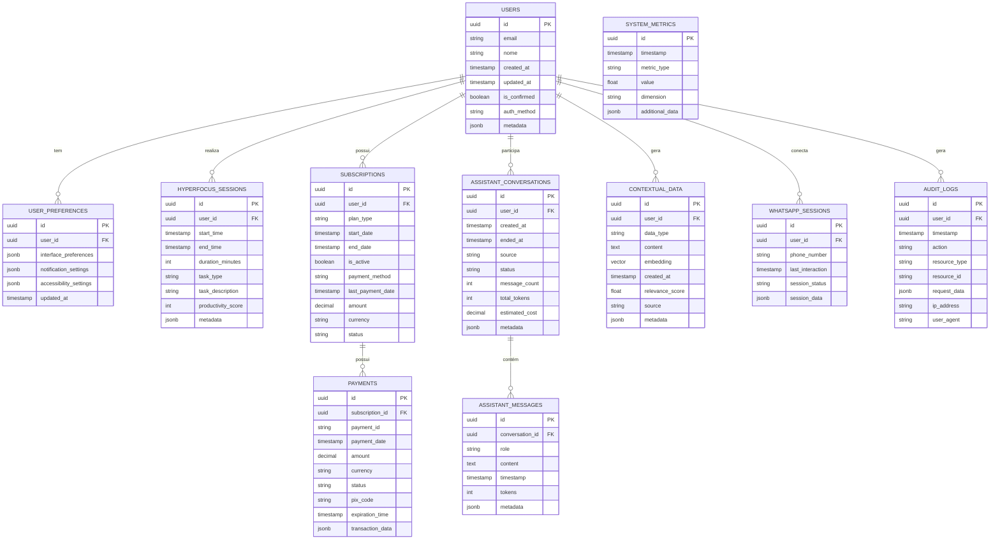

# Diagrama de Estrutura do Banco de Dados: StayFocus com Integração RAG

O diagrama acima ilustra a estrutura completa do banco de dados Supabase para o sistema StayFocus, incluindo todas as tabelas necessárias para suportar o assistente RAG, integração com WhatsApp e sistema de pagamentos PIX. Este diagrama pode ser visualizado em qualquer renderizador Mermaid, como o GitHub ou editores Markdown que suportam Mermaid.

## Principais Tabelas e Relacionamentos

### Tabelas de Usuários
- **USERS**: Armazena os dados principais dos usuários, incluindo informações de autenticação e metadados
- **USER_PREFERENCES**: Contém as preferências individuais dos usuários, incluindo configurações de interface, notificações e acessibilidade

### Tabelas de Funcionalidades Principais
- **HYPERFOCUS_SESSIONS**: Registra as sessões de foco intenso dos usuários, incluindo duração, tipo de tarefa e métricas de produtividade
- **SUBSCRIPTIONS**: Armazena informações sobre as assinaturas dos usuários
- **PAYMENTS**: Registra transações de pagamento relacionadas às assinaturas, incluindo dados específicos de PIX

### Tabelas do Assistente RAG
- **ASSISTANT_CONVERSATIONS**: Registra as conversas entre usuários e o assistente RAG
- **ASSISTANT_MESSAGES**: Armazena mensagens individuais dentro de uma conversa
- **CONTEXTUAL_DATA**: Contém dados contextuais para personalização das respostas do RAG, incluindo embeddings vetoriais para busca semântica

### Tabelas para WhatsApp
- **WHATSAPP_SESSIONS**: Gerencia sessões de conexão WhatsApp dos usuários

### Tabelas de Monitoramento
- **SYSTEM_METRICS**: Armazena métricas de desempenho do sistema
- **AUDIT_LOGS**: Registra ações importantes dos usuários para auditoria e segurança

## Campos Especiais

### Campos Vetoriais
- **CONTEXTUAL_DATA.embedding**: Campo vetorial para armazenar embeddings para busca semântica

### Campos JSONB
- Vários campos **jsonb** são usados para armazenar dados estruturados flexíveis, como metadados, preferências de interface e dados de transação

## Relacionamentos Principais

- Um usuário pode ter múltiplas sessões de hyperfocus
- Um usuário pode ter múltiplas conversas com o assistente
- Cada conversa contém múltiplas mensagens
- Um usuário pode ter múltiplos dados contextuais associados
- Um usuário pode ter uma assinatura ativa, que pode ter múltiplos pagamentos

## Considerações para Implementação

- **Índices**: Adicionar índices para campos frequentemente usados em consultas
- **RLS (Row-Level Security)**: Implementar políticas RLS do Supabase para garantir que usuários só acessem seus próprios dados
- **Índice Vetorial**: Configurar índice vetorial no campo `embedding` da tabela CONTEXTUAL_DATA para busca eficiente
- **Triggers**: Implementar triggers para manter integridade referencial e atualizar campos derivados

Este diagrama serve como referência para a criação das tabelas e relacionamentos no Supabase, seguindo as melhores práticas de modelagem de dados para sistemas com funcionalidades RAG. 